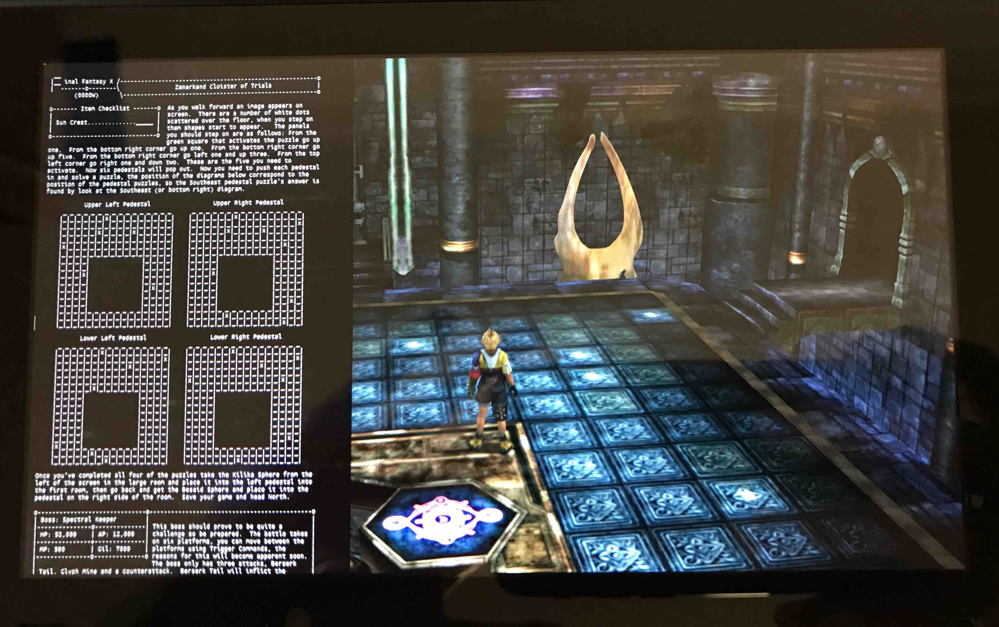

# HowDoI-NX
## BASED ON [diwo's original](https://github.com/diwo/TextReaderOverlay-NX) AND [tungns0695's patches](https://github.com/tungns0695/TextReaderOverlay-NX)

TextReaderOverlay is a Tesla overlay for your CFW'd Nintendo Switch that lets you view walkthroughs from some sites (or at least view any text files you upload to your Switch) while in-game. 

## Requirements

- [nx-ovlloader](https://github.com/WerWolv/nx-ovlloader)
- [Tesla-Menu](https://github.com/WerWolv/Tesla-Menu)
- [Atmosphere](https://github.com/Atmosphere-NX/Atmosphere)

## Installation

1. Download [nx-ovlloader](https://github.com/WerWolv/nx-ovlloader/releases) and extract it to `<SD card root>/switch/`
2. Download [Tesla-Menu](https://github.com/WerWolv/Tesla-Menu/releases) and extract it to `<SD card root>/switch/`
3. Download [Walkthrough-Overlay-NX](https://github.com/ickerday/TextReaderOverlay/releases) and extract it to `<SD card root>/switch/`
4. Place `*.txt` files anywhere on your SD card (probably best to make separate folder to avoid clutter)
5. Press `L + D-Pad-Down + R-Stick` to launch Tesla-Menu after reboot
6. Select `Text Reader` from the menu
